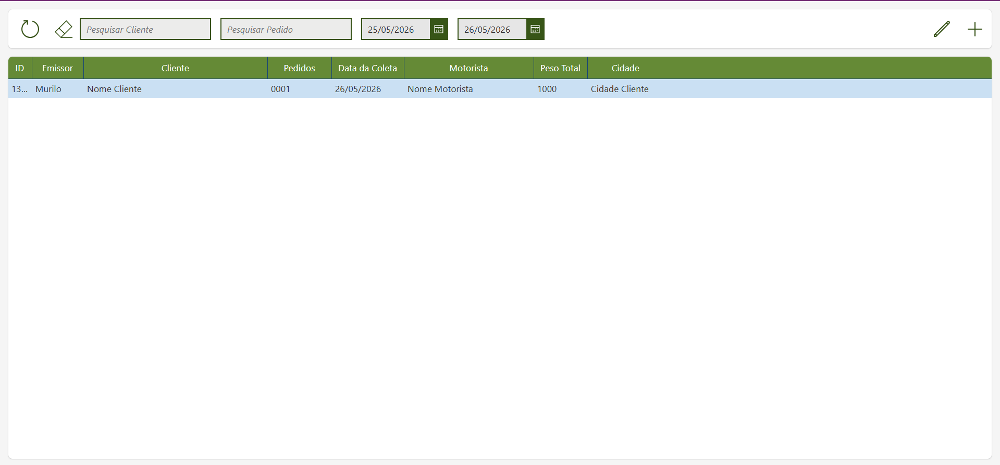
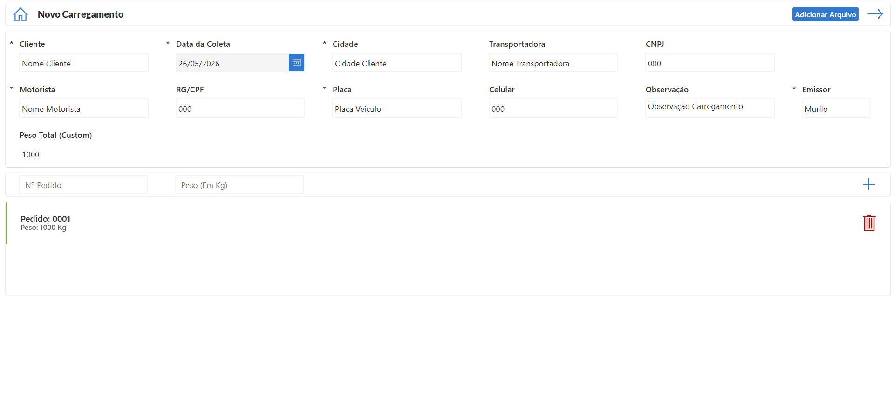
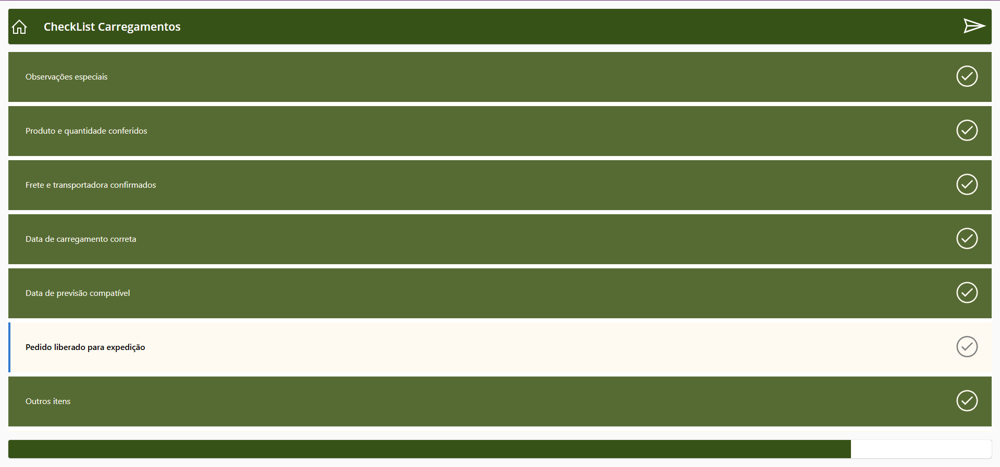
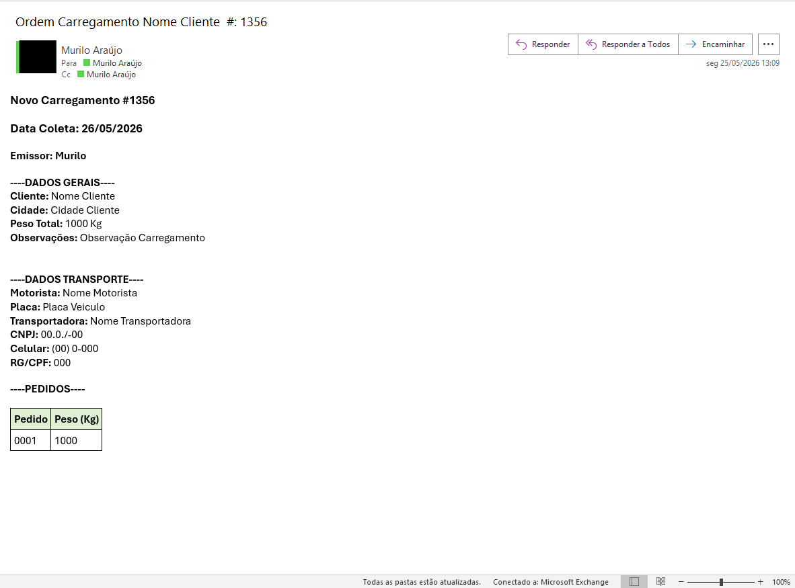

#  Controle e Gestão de Ordens de Carregamento

> Sistema interno desenvolvido em **Microsoft Power Apps** para centralizar e controlar ordens de carregamento, substituindo um processo manual baseado em fichas Word enviadas por e-mail.

---

##  Problema Resolvido

Antes do sistema, o processo de agendamento de carregamentos era feito por fichas Word enviadas por e-mail — sem histórico centralizado, sem rastreabilidade e com alto risco de informações perdidas ou desatualizadas.

O sistema resolveu isso ao criar um **ponto único de controle** para todas as ordens de carregamento, acessível pelas equipes de CS (Customer Service), Expedição e Portaria.

---

##  Funcionalidades

- **Cadastro de nova ordem** com campos estruturados: cliente, data da coleta, cidade, motorista, placa, RG/CPF, transportadora, CNPJ, pedidos e peso total
- **Envio automático de e-mail** para Expedição e Portaria ao registrar uma nova ordem, com todos os dados formatados e identificados por número sequencial
- **Listagem e busca** de ordens por cliente, número de pedido e intervalo de datas
- **Edição de ordens existentes** diretamente pelo sistema
- **Checklist de carregamento** vinculado a cada ordem (conferência de produto, frete, data, liberação para expedição, etc.)
- **Suporte a múltiplos pedidos** por ordem, com peso individual por pedido

---

##  Usuários do Sistema

| Equipe | Uso |
|---|---|
| Customer Service (CS) | Cadastro e gestão das ordens |
| Expedição | Recebimento das ordens e separação de carga |
| Portaria | Controle de entrada de veículos |

---

##  Tecnologias

- **Microsoft Power Apps** — desenvolvimento da interface e lógica da aplicação
- **Microsoft SharePoint / Dataverse** — armazenamento dos registros
- **Power Automate** — fluxo de envio automático de e-mails ao registrar nova ordem
- **Outlook / Exchange** — e-mails corporativos gerados pelo sistema

---

##  Screenshots

### Lista de Ordens
> Visualização de todas as ordens com filtros por cliente, pedido e período.

### Formulário de Novo Carregamento
> Cadastro estruturado com dados do cliente, transporte e pedidos.

### Checklist de Carregamento
> Verificação de itens obrigatórios antes da liberação do carregamento.

### E-mail Gerado Automaticamente
> Notificação enviada à Expedição e Portaria ao registrar uma nova ordem.

---

##  Impacto

- Eliminou o uso de fichas Word avulsas enviadas por e-mail
- Centralizou o histórico de todos os carregamentos em um único sistema
- Reduziu erros de comunicação entre CS, Expedição e Portaria
- Automatizou a comunicação entre equipes via e-mail estruturado

---

##  O que eu melhoraria

- Adicionar dashboard com métricas (volume por período, por cliente, por motorista)
- Integração com sistema ERP para importar pedidos automaticamente
- Notificações em tempo real via Teams ou WhatsApp além do e-mail

---

> Projeto desenvolvido para uso interno. O código-fonte não é publicado por questões de confidencialidade corporativa.
